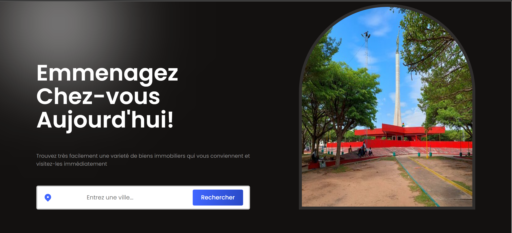

<h1 align="center">Localease Appartment</h1>
<p align="center">
</img>
</p>

## Introduction

- [Project deployed link](https://walrus-skilled-actually.ngrok-free.app) for view project demo
- [Blog Post Link](https://www.linkedin.com/posts/activity-7107834894759735296-ozAx?utm_source=share&utm_medium=member_desktop) for explain the motivation for the project

### Contributors

- [Ulrich HOUNGBO](www.linkedin.com/in/ulrich-houngbo-294500227)
- [Evence Barsour SOME](https://www.linkedin.com/in/evence-barsour-some-2b1b3a1b0/)


## Installation

For run the project in local, you need to install the following dependencies:

- [Node.js](https://nodejs.org/en/)
- [Yarn](https://yarnpkg.com/)
- [Composer](https://getcomposer.org/)
- [PHP](https://www.php.net/downloads.php)
- [MySQL](https://www.mysql.com/fr/downloads/)
- [Symfony CLI](https://symfony.com/download)

## Usage

### Clone the project

```bash
git clone https://github.com/Ulrich-HOUNGBO/Localease-Apartments.git

cd Localease-Apartments

php bin/console doctrine:database:create

php bin/console doctrine:migrations:migrate

symfony server:start
```

### Install dependencies

```bash
yarn install
```

## License

[MIT](https://choosealicense.com/licenses/mit/)